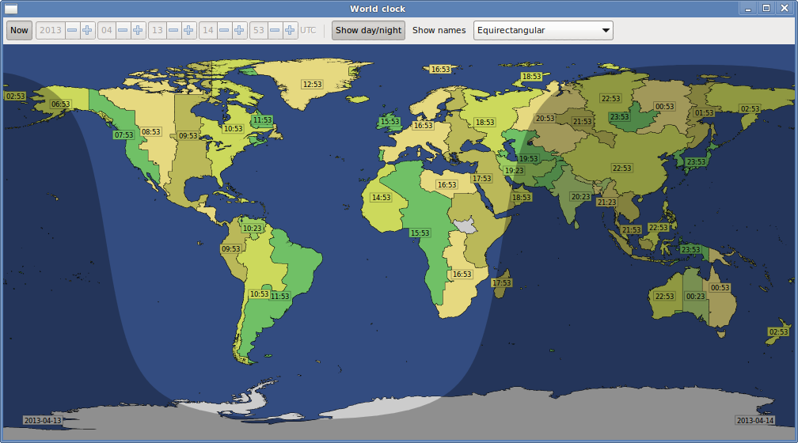

World clock
===========

Shows a map of the Earth with the local time in each time zone.

Dependencies:

- Python 3
- GTK+ 3

To regenerate the map data using convert.py you also need:

- pyshp
- Shapely
- timezones.shapefile.zip from https://github.com/evansiroky/timezone-boundary-builder/releases
- land polygons shapefile, e.g. from https://osmdata.openstreetmap.de/data/land-polygons.html
